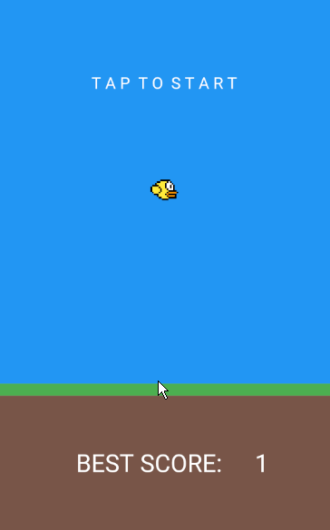

<p align="center">
      
</p>

<h2 align="center" style="font-family: Bahnschrift Condensed; font-size:30px;">👀 PREVIEW</h2>

   <p align="center">
      
   </p>

---

## 📕 Index

- [About](#-about)

- [Technologies](#-technologies)

- [How to download the project](#-how-to-download-the-project)

---

<h2 align="center">About 📖</h2>

<p align="center">
    This project was developed at in my studies of Flutter, framework of Dart.<br>
    The development of this application was fun, i could learn so much of Scratch e how to create games with Flutter.<br>
</p>

---

<h2 align="center">Functionalities 🛠️</h2>

   <p>
   
- Entertain the player
- Make the player angry

   </p>

---

<h2 align="center">How to Use 🤔</h2>

```
First of all, correctly configure the Flutter development environment on your machine, see https://flutter.dev/docs/get-started/install

- Clone this repository:
$ git clone https://github.com/harlleybastos/flappy-bird-clone.git

- Enter in directory:
$ cd flappy-bird-clone

- For install dependencies:
$ flutter pub get

- Run the app:
$ flutter run
```

---

Developed by Harlley dos Santos Bastos 🚀🖤
